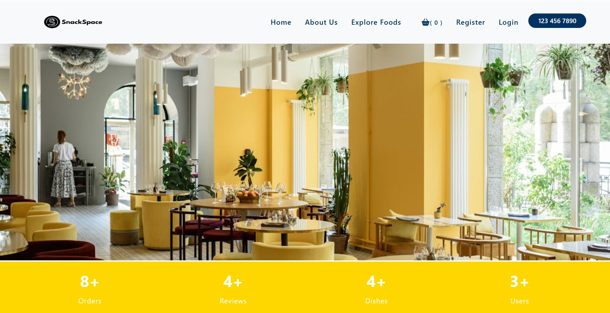
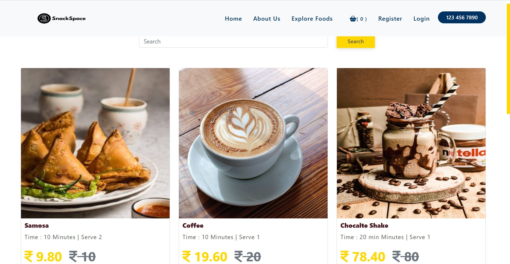
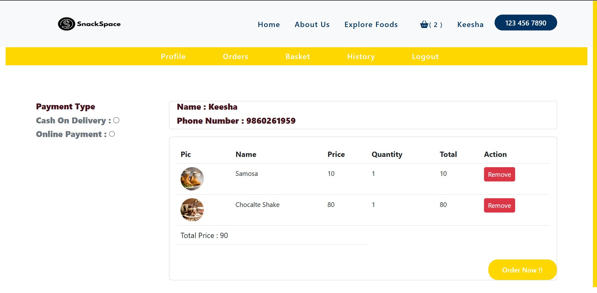
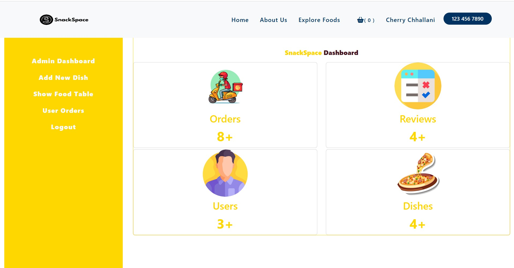

# SnackSpace - Cafeteria Management System

A web-based solution for efficient cafeteria order management and resource optimization.



## 🚀 About the Project
SnackSpace is a digital cafeteria management system that helps cafeterias streamline their ordering process, optimize inventory, and enhance the customer experience.

 

## 🎯 Key Features

### ✅ Customer Panel:
- Browse the menu and place online orders
- Pre-order and pick up to avoid waiting
- Multiple payment options (UPI, COD)
- Track order status in real-time
- Leave reviews and ratings



### ✅ Admin Panel:
- Manage menu and pricing dynamically
- Accept, reject, or update orders
- View analytics


  
## 🛠 Tech Stack

| Technology  | Description       |
|-------------|-----------------|
| **Frontend** | React.js, HTML, CSS, JavaScript |
| **Backend**  | Node.js, Express.js |
| **Database** | MongoDB |

## 🚀 Getting Started

### 1️⃣ Clone the Repository
```bash
git clone https://github.com/cherrychhallani/SnackSpace-cafeteria-management.git
cd SnackSpace-cafeteria-management
```

### 2️⃣ Install Dependencies
```bash
npm install
```

### 3️⃣ Start the Project
```bash
npm start
```
The project will start running on [http://localhost:5656](http://localhost:5656).

## 🔧 Contributing
We welcome contributions to SnackSpace! Follow these steps:
1. Fork the repository
2. Create a new branch (`git checkout -b feature-name`)
3. Commit your changes (`git commit -m "Added feature"`)
4. Push to the branch (`git push origin feature-name`)
5. Create a Pull Request

## 🤝 Contact & Support
For any queries or feature requests, reach out via:
📩 **Email:** cherrychhallani@example.com  
🌐 **GitHub:** [cherrychhallani](https://github.com/cherrychhallani)


